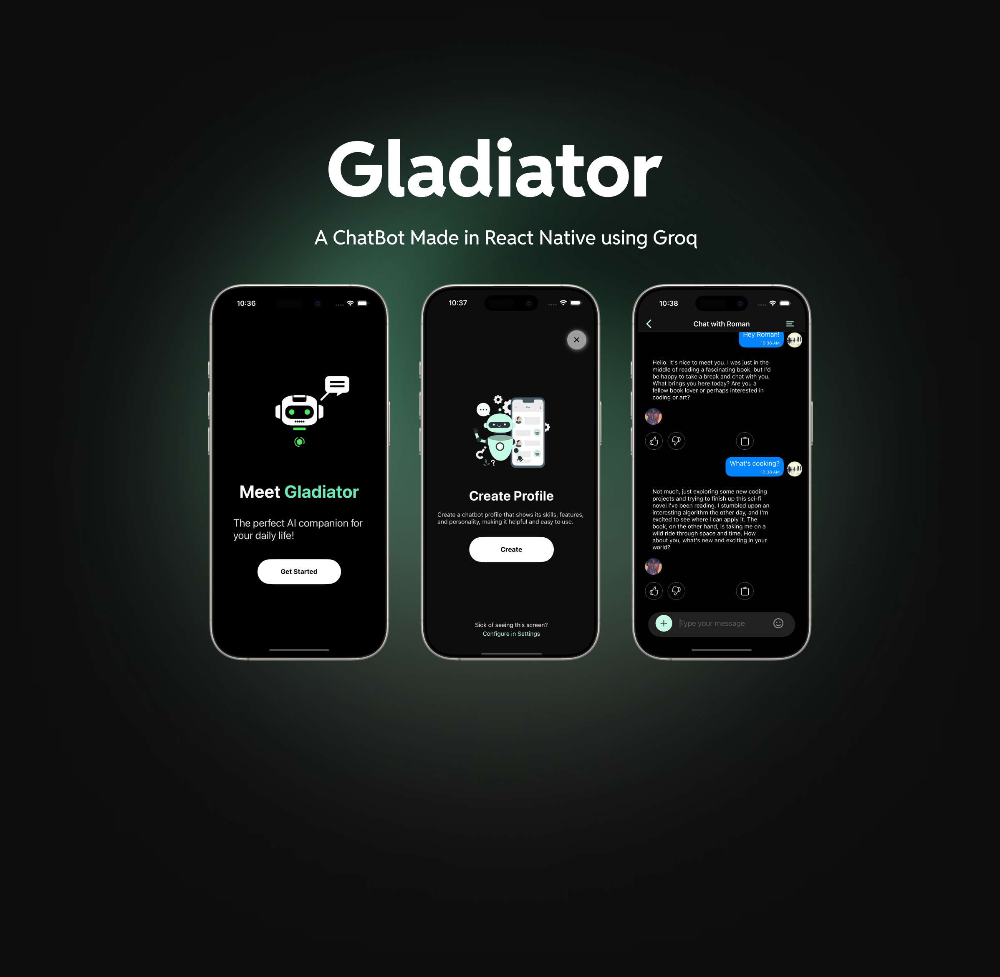

<p align="center">
  
</p>

<p align="center">
  
</p>

<p align="center">
  <a href="https://github.com/rit3zh/Fresco" target="_blank">
    
  </a>
</p>

<p align="center">
  <a href="https://github.com/rit3zh/Gladiator" target="_blank">
    
  </a>
  <a href="https://github.com/rit3zh/Gladiator" target="_blank">
    
  </a>
  <a href="https://github.com/rit3zh/Gladiator" target="_blank">
    
  </a>
  <a href="https://github.com/rit3zh/Gladiator" target="_blank">
    
  </a>
  <a href="https://github.com/rit3zh/Gladiator" target="_blank">
    
  </a>
</p>

<p align="center">
  <a href="https://www.buymeacoffee.com/rit3zh" target="_blank">
    
  </a>
</p>

# Gladiator

**Gladiator** is an open-source chatbot app powered by GROQ API. It allows you to create personalized profiles for characters or personas, offering engaging AI-driven interactions. With smooth animations, a modern interface, and fast responses, Gladiator delivers a premium chatbot experience.

---

## Features 🚀

- **Customizable Profiles**: Define the "About Me" of any character for authentic AI-driven conversations.
- **Theming**: Seamlessly switch between light and dark modes.
- **Native Animations**: Enjoy smooth, responsive animations for an immersive experience.
- **Native iOS Components**: Built using native elements for enhanced performance and aesthetics.
- **Blazingly Fast Responses**: Instant and context-aware replies powered by GROQ API.
- **Firebase and Google Authentication**: Secure user authentication powered by Firebase and Google Sign-In. [Learn more](https://firebase.google.com/docs/auth)
- **Firestore Integration**: Store user profiles and app data securely using Firebase Firestore. [Learn more](https://firebase.google.com/docs/firestore)
- **Open Source**: Modify and adapt Gladiator to fit your specific needs.

---

## Screenshots 📸

|                                                                                                                              |                                                                                                                              |                                                                                                                              |
| :--------------------------------------------------------------------------------------------------------------------------: | :--------------------------------------------------------------------------------------------------------------------------: | :--------------------------------------------------------------------------------------------------------------------------: |
|  |  |  |

---

## Setup Guide: React Native with Firebase 🔧

Follow these steps to integrate Firebase, Firestore, and Google Authentication into your React Native project.

### 1. Install Dependencies

Run the following commands:

```bash
npm install @react-native-firebase/app @react-native-firebase/auth @react-native-firebase/firestore @react-native-google-signin/google-signin
```

> [React Native Firebase Documentation](https://rnfirebase.io/)

### 2. Set Up Firebase Project

1. Visit the [Firebase Console](https://console.firebase.google.com/) and create a new project.
2. Add your app by selecting "Add App" and choosing iOS or Android.
3. Download the`GoogleService-Info.plist` (for iOS). [Detailed Setup Guide](https://firebase.google.com/docs/)

### 3. Configure Firebase in Your Project

1. Place the downloaded configuration files in the respective platform directories:
   - `GoogleService-Info.plist` → `ios/`
2. Inside Podfile add these lines of code:

```bash
  pod 'Firebase', :modular_headers => true
  pod 'FirebaseCoreInternal', :modular_headers => true
  pod 'GoogleUtilities', :modular_headers => true
  pod 'FirebaseCore', :modular_headers => true
```

```
  use_frameworks! :linkage => :static
  $RNFirebaseAsStaticFramework = true
```

### 4. Set Up Firebase Authentication

Enable authentication providers (e.g., Google, Email/Password) in the Firebase Console under **Authentication**.

**Google Sign-In** inside **SignUp.tsx** & **Login.tsx**

```typescript
import auth from "@react-native-firebase/auth";
import { GoogleSignin } from "@react-native-google-signin/google-signin";

GoogleSignin.configure({
  webClientId: "YOUR_WEB_CLIENT_ID.apps.googleusercontent.com",
});

const googleLogin = async () => {
  const { idToken } = await GoogleSignin.signIn();
  const googleCredential = auth.GoogleAuthProvider.credential(idToken);
  return auth().signInWithCredential(googleCredential);
};
```

> [Firebase Authentication Documentation](https://firebase.google.com/docs/auth)  
> [Google Sign-In Setup](https://developers.google.com/identity/sign-in/android/start)

### 5. Set Up ImgBB

Initialize ImgBB in your project:

> [!IMPORTANT]

- > Get a free API key from [ImgBB](https://api.imgbb.com/).
- > [Firestore Documentation](https://firebase.google.com/docs/firestore)

---

## Installation 🛠

1. Clone the repository:
   ```bash
   git clone https://github.com/rit3zh/Gladiator
   ```
2. Navigate to the project directory:
   ```bash
   cd Gladiator
   ```
3. Install dependencies:
   ```bash
   npm install
   ```
4. Navigate to the iOS directory and install required pods:
   ```bash
   cd ios && pod install
   ```
5. Run the app:
   ```bash
   npm run ios
   ```

---

> [!CAUTION]  
> The UI is not compatible with expo go app. You have to prebuild your expo app.

### ⭐ Consider leaving a Star if you like this repository! ⭐
